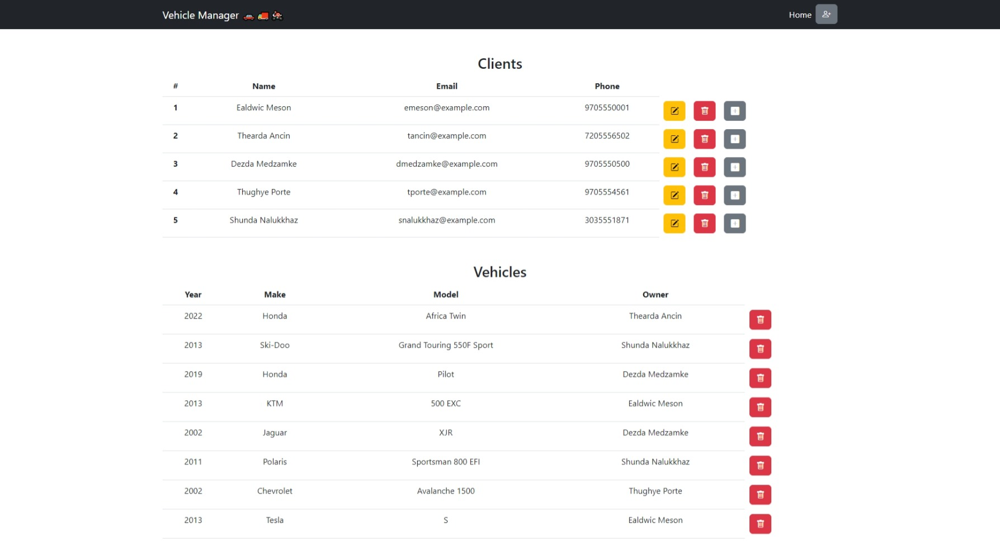
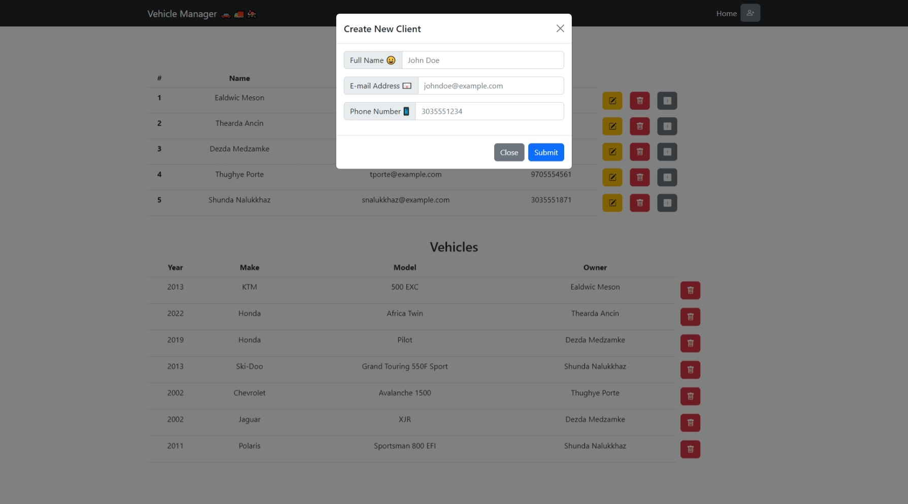
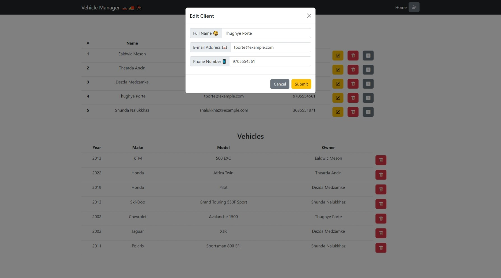
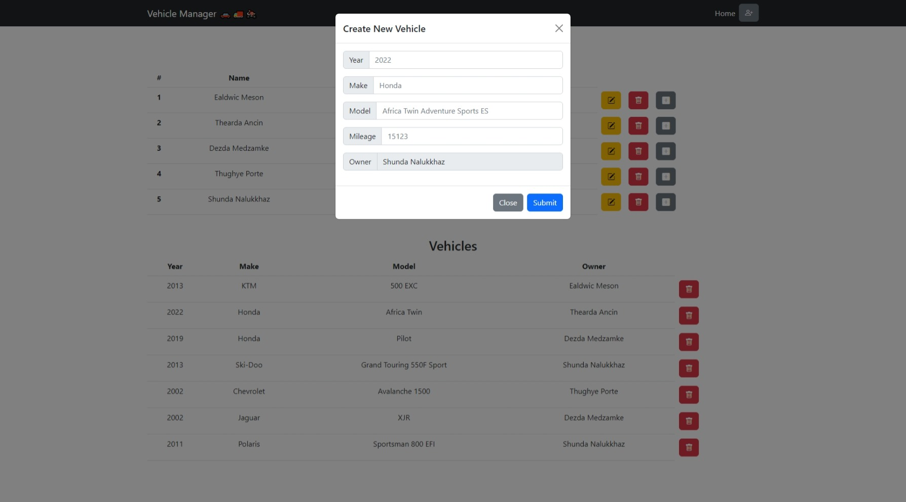
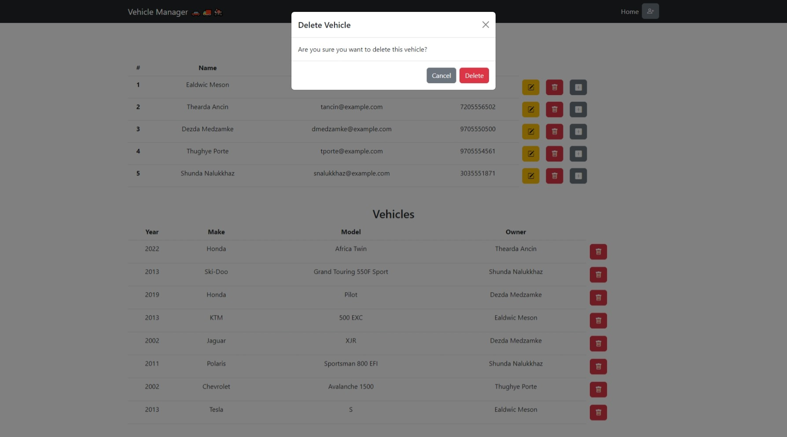

<h1 align="center">VehicleManager 🚚🚗🛵</h1>

<p align="center">
    
    
    
    
    
</p>

<p align="center">
    
    
    
    
    
        
</p>

## Description

🐍 A Python application to keep track of vehicle's in your social circle.

🤔 VehicleManager was created to demonstrate my programming abilities.

📷 Below is a screenshot of VehicleManager's frontend with example data:



## Table of Contents
- [Description](#description)
- [Table of Contents](#table-of-contents)
- [Project Overview](#project-overview)
    - [Goals](#goals)
    - [Known Issues](#known-issues)
    - [Feature Wishlist](#feature-wishlist)
- [Getting Started](#getting-started)
    - [Project Setup](#project-setup)
    - [App Usage](#app-usage)
- [License](#license)
- [Acknowledgements](#acknowledgements)

## Project Overview

### Goals

📦 The goal of this project was to create a working web app with Python. I wanted to demonstrate my programming abilities.

👨‍🎓 As my skills progress, I want to update this app to reflect those changes.

💪 I'm proud of what I have created so far and want to build off of this.

### Known Issues

The following is a list of issues that I know of:
- [ ] Deleting a client without deleting the vehicle leaves undeletable vehicle in the database 😐
- [ ] There is no validation on the frontend 😔
- [ ] Error handling is lacking 😑

### Feature Wishlist

This is what I plan on implementing in the near future:
- [ ] Error Handling
- [ ] Input Validation
- [ ] Deployable Docker container 🐳
- [ ] Login Page
- [ ] HTTPS instead of HTTP

## Getting Started

📌 Below you'll find the steps needed to take to setup the project and how to use it.

⚠️ Take note of any caution symbols you see! Some features haven't been implemented yet.

### Project Setup

📌 Make sure you have a modern browser, Python, and Visual Studio Code installed.

* Originally was developed with Python version 3.10.7.

* The following browsers were tested:
    - 
    - 

📌 Before running VehicleManager, we need to follow these steps:

1. Download the repository:
    ```
    git clone https://github.com/Xata/vehiclemanager.git
    ```

2. Setup the Python virtual environment:
    ```
    python -m venv venv
    ```

3. Activate the Python virtual environment:
    * 
        ```powershell
        .\venv\Scripts\Activate.ps1
        ```
    * 
        ```bash
        source venv/Scripts/activate
        ```
    * 
        ```zsh
        source venv/Scripts/activate
        ```

4. Install the required libraries with pip:
    ```
    pip install -r requirements.txt
    ```

### App Usage

📌 To run VehicleManager follow these steps:

1. In Visual Studio Code:
    - Ensure that main.py is the current file
    - Ensure that the Python virtual environment is activated
    - Verify that the required libraries are installed

2. Run main.py:
    - In your terminal:
        ```python 
        python main.py
        ```
    - Run it through Visual Studio Code

3. You should see Uvicorn running:


4. In your browser, navigate to:
    - http://127.0.0.1:8000/
    - ⚠️ If this is your first time running the app, there won't be any data to display.

📌 How to use VehicleManager:

- Create a new client:
    - ⚠️ Clients cannot have the same phone number or email address
    - ⚠️ A UUID is generated in the background to identify the client
    1. Click the icon in the top right corner
    2. Enter the data to create a new client!



- Edit a client:
    - ⚠️ The current client data is automatically put in the fields
    - ⚠️ Every field needs to have something in it for the backend to accept it
    1. Click the yellow button on the row of the client you want to edit
    2. Press submit when edits are done!



- Delete a client:
    - ⚠️ WARNING: The client CANNOT have any vehicles attached to them first!!
    1. Click the red button on the row of the client you want to remove
    2. Press confirm and you'll have deleted the client!

- Create a new vehicle:
    - ⚠️ You cannot change the owner field
    - ⚠️ Mileage is not displayed on the table
    1. Click on the plus button on the row of the client
    2. This will toggle the modal and now you can enter the values
    3. Press submit to create the vehicle!



- Delete a vehicle:
    - ⚠️ WARNING: You must delete all of the vehicles attached to a client before removing that client!!
    1. Click on the red button on the row of the vehicle you want to remove
    2. Press confirm to delete the vehicle!



## License

This project is licensed under the MIT License - see the [LICENSE.md](docs/LICENSE.md) file for details

## Acknowledgements

Inspiration, code snippets, etc.
* [FastAPI Documentation](https://fastapi.tiangolo.com/)
* [Pydantic Documentation](https://pydantic-docs.helpmanual.io/)
* [SQLAlchemy Documentation](https://docs.sqlalchemy.org/en/14/orm/quickstart.html)
* [Mozilla MDN Web Docs on FetchAPI](https://developer.mozilla.org/en-US/docs/Web/API/Fetch_API)
* [JSDoc on how to document JavaScript Code](https://jsdoc.app/)